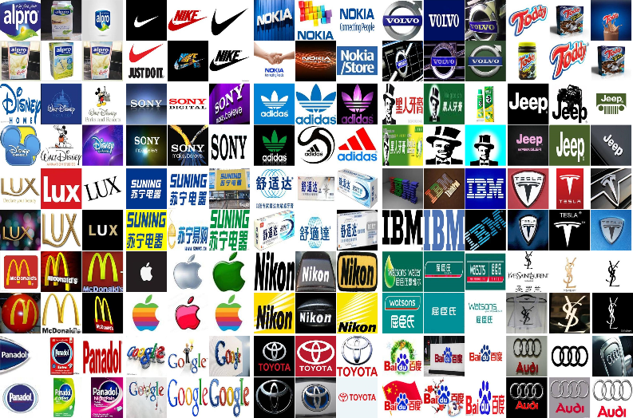

# <p align="center"> Logo-2K+:A Large-Scale Logo Dataset for Scalable Logo Classification </p>

## Logo-2k+ Dataset
\

## Logo-2k+ Dataset Description
In this work, we construct a large scale logo dataset, Logo-2K+, which covers a diverse range of logo classes from real-world logo images.
Our resulting logo dataset contains `167,140` images with 10 root categories and `2,341` categories. \
The statistic comparison of 10 root categories from Logo-2K+ is shown as follows. 

| Root Category        | Logos           | Images  |
| ------------- |:-------------:| -----:|
| Food          |    769        | 54,507 |
| Clothes       |    286        | 20,413 |
| Institution   |    238        | 17,103 |
| Accessories   |    210        | 14,569 |
|Transportation |    203        | 14,719 |
|Electronic     |    191        | 13,972 |
|Necessities    |    182        | 13,205 |
|Cosmetic       |    115        |  7,929 |
|Leisure        |    99         |  7,338 |
|Medical        |    48         |  3,385 |
|Total          |    2,341      |167,140 | 

## Download links
Baidu Drive link: https://pan.baidu.com/s/11G2CI6zUvb700_nygUjs4Q  password: plbq 

Google Drive link: https://drive.google.com/open?id=1PTA24UTZcsnzXPN1gmV0_lRg3lMHqwp6 

# DRNA-Net

The code will be uploaded soon!


## Reference
If you are interested in our work and want to cite it, please acknowledge the following paper:

```
@inproceedings{Wang2020Logo2K,
author={Jing Wang, and Weiqing Min, and Sujuan Hou, and Shengnan Ma, and Yuanjie Zheng, and Haishuai Wang, and Shuqiang Jiang},
booktitle={AAAI Conference on Artificial Intelligence. Accepted},
title={{Logo-2K+:} A Large-Scale Logo Dataset for Scalable Logo Classification},
year={2020}
}
```
